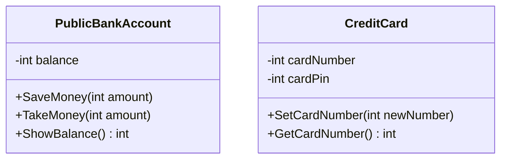

# Encapsulation

## Understanding the Concept

**Encapsulation** refers to:

- Combining data and methods that operate on that data into a single class.
- Restricting access to the inner components of the class (access control), allowing you to protect and control how data is modified or accessed.

In this project, we explore encapsulation through two main classes: `PublicBankAccount` and `CreditCard`.

## Classes Overview

### PublicBankAccount Class

This class demonstrates encapsulation by keeping the balance field private and providing methods to modify the balance safely.

Key methods:

- `SaveMoney(int amount)`: Increases the balance.
- `TakeMoney(int amount)`: Decreases the balance.
- `ShowBalance()`: Returns the current balance.

### CreditCard Class

This class encapsulates the card number and pin by using private fields and methods to get or set these values.

Key methods:

- `SetCardNumber(int newNumber)`: Sets the card number.
- `GetCardNumber()`: Retrieves the card number.

## UML Diagrams

### PublicBankAccount Class UML Diagram



## How to Run

To run the project:

1. Navigate to the project directory using your terminal.

```bash
cd <file-name>
```

2. Run the following command:

```bash
dotnet run
```
